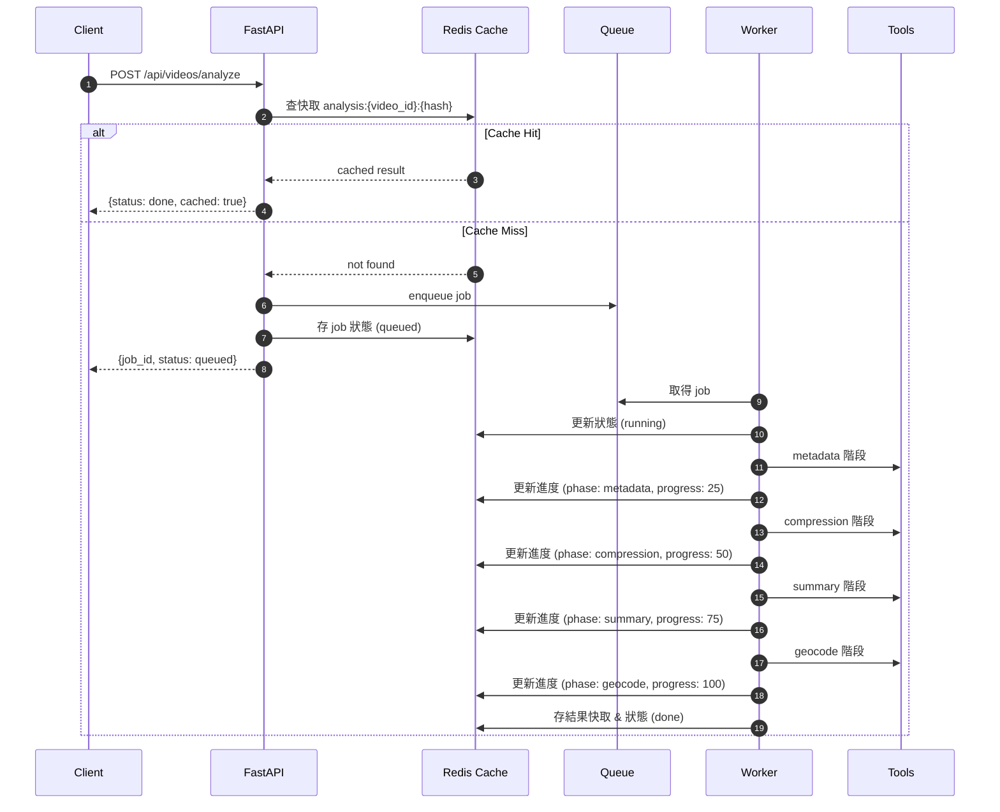
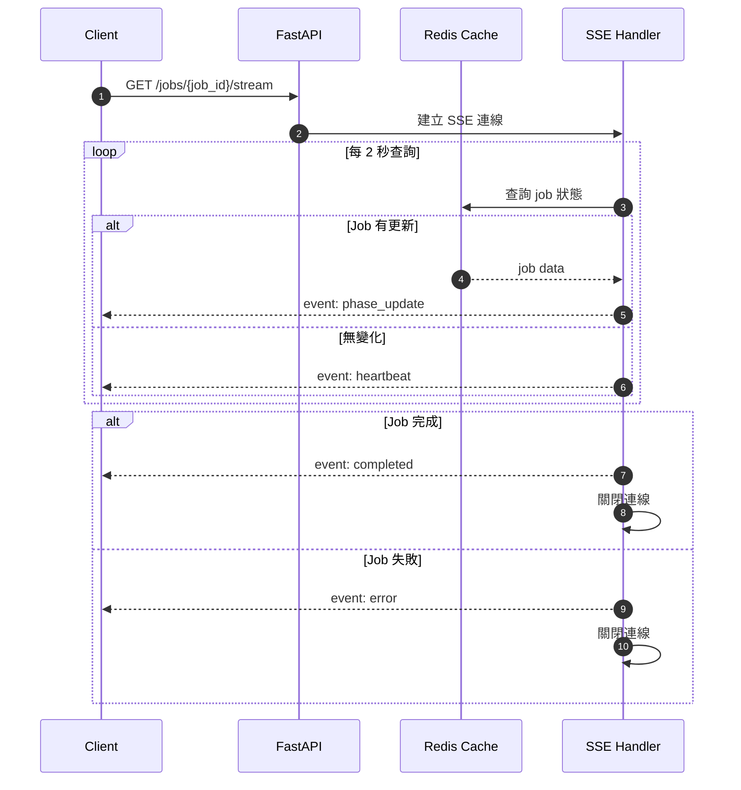
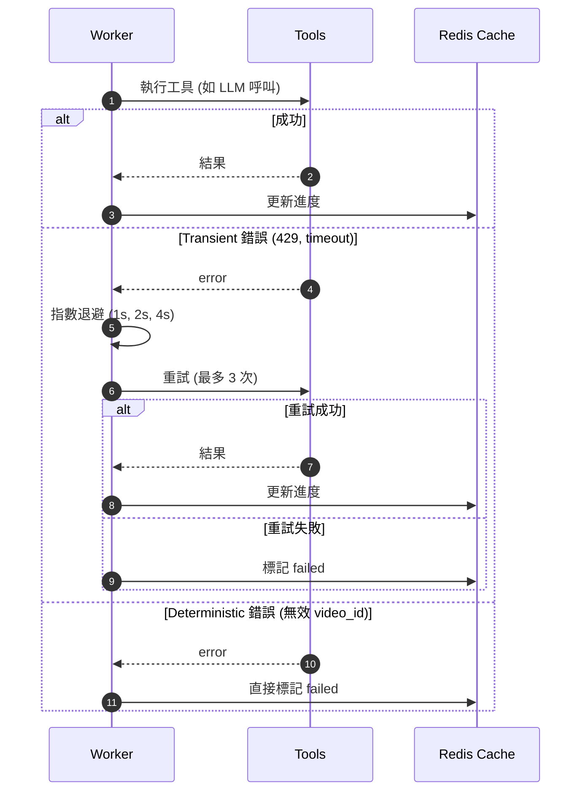

# TrailTag 後端 API 規格書

本規格書為[主要提案](project-proposal.md)的後端實作規範。

## 目標

- 提供 REST API 與 SSE 進度查詢，支援非同步任務、快取，易於維護。

## 架構簡述

- FastAPI 為主，API 路由集中於 `src/api/routes.py`。
- 主要流程：
  1. analyze 請求先查快取，命中直接回傳。
  2. 未命中則建立 job，非同步執行分析。
  3. 進度/錯誤即時回報，結果寫入快取。
- Redis 為快取與狀態儲存主體，memory fallback。
- crew.py 負責分析邏輯，工具層如 subtitle_compression_tool、place_geocode_tool。

## 主要端點

| Method | Path | 說明 |
| ------ | ---- | ---- |
| POST | /api/videos/analyze | 提交分析任務，快取命中直接回傳 |
| GET | /api/jobs/{job_id} | 查詢任務進度與狀態 |
| GET | /api/jobs/{job_id}/stream | SSE 事件推播進度 |
| GET | /api/videos/{video_id}/locations | 取得地點視覺化結果 |

## Job 狀態與階段

- 狀態：queued / running / partial / failed / done
- 階段：metadata / compression / summary / geocode

## 資料結構（簡化）

```json
{
  "job_id": "...",
  "video_id": "...",
  "status": "running",
  "phase": "compression",
  "progress": 35.0,
  "created_at": 1734031000,
  "updated_at": 1734031020,
  "error": null
}
```

## 快取策略

- 先查 `analysis:{video_id}:{strategy_version}`，命中直接回傳。
- strategy_version 由分析參數 hash 得出。
- Redis 不可用時 fallback memory cache。

## 進度計算

- 依各階段完成比例加總。
- metadata：下載/解析步驟完成比例。
- compression：已壓縮段數 / 總段數。
- summary：已摘要 chunk / 總 chunk。
- geocode：成功 geocode 地點 / 總地點。

## SSE 事件

- phase_update：job_id, phase, progress, ts
- heartbeat：job_id, status, ts
- completed：job_id, status=done, progress=100
- error：job_id, status=failed, error

## 錯誤分類

- transient：如 LLM timeout/429，重試 3 次失敗則 fail
- deterministic：如無效 video id，直接 fail
- partial：部分 geocode 失敗，status=partial

## 後端 AI Agent 流程

### 主要序列圖



### SSE 進度推播



### 錯誤處理與重試



## 測試策略

- Unit：hash、快取、分析流程
- Integration：cache miss/hit、進度計算
- Contract：API schema 完整性
- Load：佇列堆疊
- Retry：transient 錯誤重試
