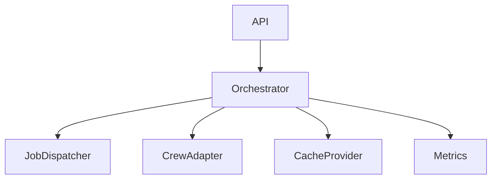

# TrailTag 後端 API 精簡計劃

## 目標

- 提供 REST API 與 SSE 進度查詢，支援非同步任務、快取、可觀測性，並易於維護擴展。

## 架構分層



## 運作流程

1. Client 請求 analyze，API 先查快取，命中直接回傳。
2. 未命中則建立 job，交由 Dispatcher 非同步執行。
3. CrewAdapter 執行各階段，進度/錯誤即時回報。
4. 結果寫入快取，SSE/輪詢查詢進度。

## 最小功能清單

- FastAPI + /health
- 分層協調（Orchestrator, Dispatcher, Adapter, Cache）
- Redis 快取與狀態
- 非同步任務排程
- SSE 進度推播
- 基本錯誤分類與重試

## Backlog（精簡版）

1. FastAPI skeleton + /health
2. Orchestrator + 快取檢查
3. CrewAdapter 包裝 crew.py
4. Redis CacheProvider
5. 非同步 Dispatcher (InMemory) + 狀態查詢
6. SSE 進度推播
7. Geocode 失敗重試

## 狀態定義

- Job 狀態：queued / running / partial / failed / done
- Phase：metadata / compression / summary / geocode

## 架構概要

- FastAPI (REST + /health + /metrics)。
- 協調層：`AnalysisOrchestrator`。
- 排程層：`JobDispatcher`（InMemory ThreadPool）。
- Redis：`analysis:*`, `job:*`, `geocode_fail:*`。
- CrewAI：沿用 `crew.py` 中 `Trailtag` Agents + Tasks。
- SSE：由狀態輪詢/事件推播。

## 介接設計 (CrewAI ↔ Orchestrator/API)

### 分層

```text
[API Routers]
  └─ AnalysisController
       └─ AnalysisOrchestrator
            ├─ JobDispatcher (InMemory)
            ├─ TrailtagCrewAdapter (wrap crew.py)
            ├─ CacheProvider (Redis/Memory fallback)
            └─ Metrics & Logging Hooks
```

### 職責摘要

- AnalysisOrchestrator：策略 hash、快取短路、建/更 job、進度/錯誤分類。
- TrailtagCrewAdapter：呼叫 `Trailtag().crew().kickoff()`；映射 Task→Phase；人工補 compression 階段事件。
- JobDispatcher：非同步 submit / (未來 cancel)。
- CacheProvider：get/set/exists + TTL + degraded fallback。

### Phase 對應

| Phase | Crew Task / 行為 | 備註 |
| ----- | ---------------- | ---- |
| metadata | `video_metadata_extraction_task` | 抓 metadata + 字幕 (guardrail) |
| compression | SubtitleCompressionTool | Adapter 人工標記進度 |
| summary | `video_topic_summary_task` | 主題/地點抽取 |
| geocode | `map_visualization_task` | PlaceGeocodeTool + callback |

### 流程（Cache Miss）

1. 組策略輸入 → `strategy_hash`。
2. 查 `analysis:{video_id}:{hash}` 命中 → 返回 done+cached。
3. 未命中 → 建立 `job:{job_id}` (queued)。
4. Dispatcher.submit 背景執行 Adapter。
5. Adapter 逐 Phase 更新：phase、intra 進度、累計 progress。
6. 錯誤分類（transient 重試 / deterministic 直接 fail / partial geocode）。
7. 成功：寫入結果快取 + status=done。

### 進度計算（詳細）

```text
total_progress = Σ finished_phase_weight + current_phase_weight * intra_phase_ratio
```

來源：

- metadata：下載/解析步驟完成比例。
- compression：已壓縮段數 / 總段數。
- summary：已摘要 chunk / 總 chunk。
- geocode：成功 geocode 地點 / 總地點。

### SSE 事件

| event | payload 主要欄位 |
| ----- | --------------- |
| phase_update | job_id, phase, progress, ts |
| heartbeat | job_id, status, ts |
| completed | job_id, status=done, progress=100 |
| error | job_id, status=failed, error {type,message} |
| partial_locations (可選) | job_id, locations[], progress |

### 錯誤分類

| 類別 | 來源 | 策略 |
| ---- | ---- | ---- |
| transient | LLM Timeout / 429 | 指數退避 ≤3 → fail(transient) |
| deterministic | 無效 video id | 立即 fail(deterministic) |
| partial | 部分 geocode 失敗 | status=partial + 記錄失敗列表 |

### 失敗地點記錄 (Redis)

Key: `geocode_fail:{video_id}:{strategy_hash}`

```json
{
  "failed": [{"raw": "Shilin Night", "reason": "not_found"}],
  "retryable": true,
  "last_updated": 1734031000
}
```

### 快取 Keys

| 用途 | Key | TTL | 備註 |
| ---- | --- | --- | ---- |
| 結果 | analysis:{video}:{hash} | 7d | MapVisualization |
| Job 狀態 | job:{job_id} | 24h | SSE / 查詢 |
| 失敗地點 | geocode_fail:{video}:{hash} | 7d | retry |

### Strategy Hash

```python
strategy_input = {
  "model": llm.model_name,
  "model_temp": 0.7,
  "compression_ratio": 0.4,
  "extraction_prompt_v": 2,
  "geocode_mode": "std"
}
strategy_hash = sha1(json.dumps(strategy_input, sort_keys=True)).hexdigest()[:8]
```

### 介面草稿

```python
class JobDispatcher(Protocol):
    def submit(self, job_id: str, fn: Callable[[], None]) -> None: ...

class AnalysisOrchestrator:
    def analyze(self, video_url: str, params: dict) -> JobStatus: ...
    def get_status(self, job_id: str) -> JobStatus: ...
    def get_result(self, video_id: str, strategy_hash: str) -> MapVisualization | None: ...
```

### 同步 vs 非同步

| 面向 | M2 同步 | M3+ 非同步 |
| ---- | ------- | ---------- |
| analyze 回應 | 完成後返回 | 立即 job_id |
| 進度顯示 | 無或最終 100% | SSE / polling |
| Dispatcher | 無 | InMemory |
| 重試 | 直接內部 | 背景策略化 |

### 可觀測性 Hook

| 類型 | Hook | 指標 |
| ---- | ---- | ---- |
| Phase timing | phase start/end | phase_duration_seconds |
| Token usage | LLM 回應後 | tokens_in / tokens_out |
| Geocode 成功率 | 每地點完成 | geocode_success_ratio |

### 安全 / 限速順序

1. CORS 白名單 (M2)
2. IP Rate Limit (M3)
3. API Key header (P1.5)

### Degraded 策略

Redis 失效 → fallback memory (LRU) + 對 /health 與 metrics 增加 degraded 標記。

## 端點設計

| Method | Path | 說明 | 回傳 |
| ------ | ---- | ---- | ---- |
| POST | /api/videos/analyze | 提交或命中快取 | job_id, status, cached |
| GET | /api/jobs/{job_id} | 查進度 | job_id, status, phase, progress, stats |
| GET | /api/jobs/{job_id}/stream | SSE 事件 | phase_update/completed/error/heartbeat |
| GET | /api/videos/{video_id}/locations | 取得視覺化 | MapVisualization |

`MapVisualization` 範例：

```json
{
  "video_id": "abc123",
  "routes": [
    {
      "location": "Taipei 101",
      "coordinates": [121.5645, 25.0339],
      "description": "觀景台夜景",
      "timecode": "00:05:12,000",
      "tags": ["landmark"],
      "marker": "poi"
    }
  ]
}
```

## 狀態與階段定義

| Phase | 權重 | 描述 |
| ----- | ---- | ---- |
| metadata | 10 | 下載 metadata + 字幕 |
| compression | 25 | 字幕分段 + 壓縮 |
| summary | 35 | 主題/地點抽取 |
| geocode | 30 | 地點地理編碼與組合 |

Progress = Σ 完成階段權重 + 當前階段權重 * intra_phase_ratio。

## Job 狀態列舉

queued / running / partial / failed / done / canceled

## 資料結構 (概念 JSON)

```text
Job {
  job_id: str,
  video_id: str,
  status: str,
  phase: str,
  progress: float,
  created_at: ts,
  updated_at: ts,
  strategy_version: str,
  metrics: {
    tokens_in: int,
    tokens_out: int,
    locations_found: int
  },
  error: { type: str, message: str } | null
}
```

## 快取與冪等策略

- 先查 `analysis:{video_id}:{strategy_version}`；命中→done+cached。
- `strategy_version` = 模型 / 壓縮 / 抽取規則 hash。
- 策略升級 → 新 hash；不覆蓋舊結果。

## 失敗分類與重試

| 類型 | 範例 | 處理 |
| ---- | ---- | ---- |
| transient | 429, timeout | 指數退避 3 次 → fail |
| deterministic | invalid video id | 直接 fail |
| partial | subset geocode fail | status=partial + retriable flag |

## 可觀測性

- JSON 行日誌：job_id, phase, elapsed_ms, event_type。
- 指標：jobs_total、jobs_running、phase_duration_seconds_bucket、geocode_success_ratio。
- Tracing：OpenTelemetry (P2+)。

## 安全與限速

- IP Rate Limit (token bucket)。
- API Key header（P1.5）。
- CORS：白名單 extension origin + localhost。

## 交付分階段 (Milestones)

| Milestone | 內容 | 完成判準 |
| --------- | ---- | -------- |
| M1 Skeleton | FastAPI + /health | 200 OK |
| M2 Analyze Sync | 同步 analyze | status=done 回傳 |
| M3 Async Queue | Dispatcher + 狀態查詢 | 進度可查 |
| M4 SSE | /jobs/{id}/stream | 即時推進度 |
| M5 Cache | Redis 快取 | 命中 <100ms |
| M6 Partial Push | (可選) geocode partial | 增量更新 |
| M7 Metrics | /metrics 指標 | Prometheus 抓取 |
| M8 Retry Geocode | retry 端點 | 失敗補全 |

## 詳細任務分解 (Backlog)

### M1~M2

- Skeleton (`src/api/`)。
- TrailtagCrewAdapter 初版。
- AnalysisOrchestrator 同步 + 快取檢查 + strategy hash。
- 同步 POST /api/videos/analyze。

### M3

- Dispatcher 抽象 + InMemory(ThreadPool)。
- Redis Job 狀態 Hash。
- GET /api/jobs/{id}。
- 非同步 analyze 回傳 job_id。
- Phase/Progress 更新事件。

### M4

- SSE router + heartbeat (5s)。
- Token 使用統計。
- 錯誤分類器。

### M5

- 策略 Hash 函式標準化 + metrics.strategy_hash。
- Degraded 模式 (Redis fallback)。

### M6

- (可選) geocode partial 推送與合併策略。

### M7

- Metrics decorator + /metrics。
- Phase 計時與 geocode 成功率。

### M8

- retry 地點端點與邏輯。
- 失敗地點統計重試後淨減少。

## 新增細化工作 (Integration)

| ID | 任務 | 說明 | 里程碑 |
| -- | ---- | ---- | ------ |
| INT-01 | Strategy Hash 工具 | 策略 dict → hash | M2 |
| INT-02 | CacheProvider | Redis get/set/exists | M2 |
| INT-03 | TrailtagCrewAdapter | kickoff + phase hooks | M2 |
| INT-04 | Phase 事件機制 | Adapter 觸發 update_job | M3 |
| INT-05 | JobDispatcher | InMemory ThreadPool | M3 |
| INT-06 | Orchestrator 非同步化 | analyze 回傳 job_id | M3 |
| INT-07 | SSE 實作 | 事件/heartbeat | M4 |
| INT-08 | Token 統計 | 攔截 LLM 回應 | M4 |
| INT-09 | 錯誤分類器 | 異常正規化 | M4 |
| INT-10 | Metrics 佈建 | /metrics + 指標 | M7 |
| INT-11 | Geocode retry | retry 端點 | M8 |
| INT-12 | Degraded 模式 | Redis fallback | M5 |
| INT-13 | Partial geocode | 增量推送 (可選) | M6 |

## 測試策略

| 類型 | 重點 | 範例 |
| ---- | ---- | ---- |
| Unit | Hash / Adapter / Dispatcher | 固定輸入 → 同 hash |
| Integration | cache miss/hit | 第二次 analyze cached=true |
| Integration | 進度計算 | 模擬 5 地點 geocode 逐步更新 |
| Contract | API schema | analyze 回傳欄位完整 |
| Load | 佇列堆疊 | 10 並發 < X 秒完成 |
| Retry | transient 錯誤 | 模擬 429 → 成功重試 |

## 開發順序（每日）

Day1: Skeleton + Strategy Hash + CacheProvider
Day2: 同步 Orchestrator + Adapter + 快取
Day3: Dispatcher + 非同步 analyze + 狀態
Day4: SSE + Phase 事件 + heartbeat
Day5: Metrics decorator + /metrics + token usage
Day6: Error 分類 + retry 策略 + degraded 測試
Day7: Geocode 失敗紀錄 + retry 端點
Day8: 文件 / 清理 / 補測試

## 風險與緩解

| 風險 | 描述 | 緩解 |
| ---- | ---- | ---- |
| 長任務阻塞 | 初期同步 | 優先完成 M3 佇列化 |
| Redis 不可用 | 狀態/快取缺失 | memory fallback + 告警 |
| 模型成本升高 | 重複分析 | 積極結果快取 + 策略版本 |
| Geocode 失敗率高 | 模糊地名 | 語境補強 + 重試 + retry 端點 |

## 後續延伸 (Beyond P1.5)

- WebSocket 雙向控制（取消任務 / 動態策略）。
- 多影片批次分析。
- OpenTelemetry Tracing。

## 實作備註

- 無 ORM，直接 JSON + 輕量索引。
- I/O 與 LLM 呼叫包裝 executor 避免阻塞事件迴圈。
- 工具層純邏輯，協調層負責狀態與串接。
- 版本化策略參數，避免快取污染。
| INT-10 | Metrics 佈建 | /metrics + 指標 | M7 |
| INT-11 | Geocode retry | retry 端點 | M8 |
| INT-12 | Degraded 模式 | Redis fallback | M5 |
| INT-13 | Partial geocode (可選) | 增量推送合併 | M6 |

## 測試策略補充

| 測試類型 | 重點 | 範例 |
| -------- | ---- | ---- |
| Unit | Hash / Adapter / Dispatcher | 固定輸入 → 同 hash |
| Integration | cache miss/hit | 連續 analyze 第二次 cached=true |
| Integration | Phase 進度 | 模擬 5 地點 geocode 漸進 |
| Contract (API) | JSON schema | analyze 回傳欄位完整 |
| Load | 佇列堆疊 | 10 並發 analyze < X 秒全部完成 |
| Retry | transient 錯誤 | 模擬 429 → 重試成功 |
