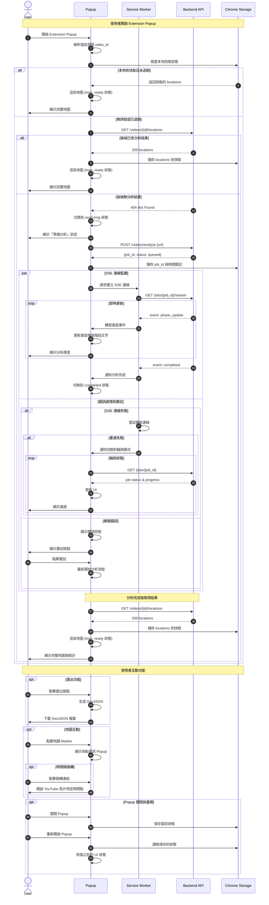

# TrailTag 前端 Chrome Extension 規格書

本規格書為[主要提案](project-proposal.md)的前端實作規範。

## 概述

本文件聚焦 TrailTag 的 Chrome Extension。Extension 讀取目前 YouTube 影片頁 URL，向後端查詢是否已有地點分析結果，若無則觸發分析並以 SSE/輪詢顯示進度與部分地點，完成後顯示互動地圖。

## 使用者旅程 (User Flow)

1. 使用者於 YouTube 影片頁開啟 Extension popup。
2. 系統解析 video_id，呼叫 `GET /api/videos/{id}/locations`。
3. 若已有資料 → 直接顯示地圖。
4. 若 404 → 呼叫 `POST /api/videos/analyze` 取得 job_id。
5. 建立 SSE 連線或啟動輪詢更新進度。
6. 在進度完成時，呼叫。
7. 完成後顯示統計與匯出功能。

## 前端流程循序圖

以下循序圖詳細說明 Chrome Extension 前端組件之間的互動流程，以及與後端 API 的完整通訊過程：



### 狀態轉換說明

Extension Popup 主要狀態轉換：

1. **idle** → **checking_cache**：Popup 開啟時自動檢查快取
2. **checking_cache** → **map_ready**：快取命中，直接顯示地圖
3. **checking_cache** → **analyzing**：快取未命中，開始分析流程
4. **analyzing** → **map_ready**：分析完成，顯示結果
5. **analyzing** → **error**：分析失敗，顯示錯誤
6. **error** → **analyzing**：使用者點擊重試

### SSE 與輪詢策略

- **主要方式**：SSE 即時連線，低延遲更新進度
- **備援方式**：SSE 失敗時自動切換到輪詢模式
- **重連機制**：SSE 中斷時自動嘗試重新連線一次
- **輪詢頻率**：每 2-3 秒查詢一次 job 狀態

## 功能列表 (MVP)

| 功能 | 描述 | 優先級 |
| ---- | ---- | ------ |
| 影片辨識 | 解析當前 tab YouTube video_id | P0 |
| 查詢既有分析 | 快速判斷快取是否存在 | P0 |
| 觸發分析 | 呼叫 /analyze 取得 job_id | P0 |
| 進度顯示 | 百分比 + 階段文字 | P0 |
| SSE 連線 | 接收 phase_update / completed / error | P0 |
| 地點地圖渲染 | Leaflet 基本地圖 + Marker | P0 |
| 結果呈現 | 任務完成後一次性載入全量地點 | P0 |
| 錯誤處理與重試 | 基本重試 + 提示訊息 | P0 |
| 匯出 GeoJSON | 從現有 locations 生成 | P1 |
| Marker clustering | >20 地點時分群 | P1 |
| 時間碼跳轉 | Marker popup 提供跳轉影片功能 | P1 |
| 狀態快取 | chrome.storage 保存最近 job | P1 |
| 主題顯示 | 顯示摘要主題或標籤 | P2 |

## 架構與檔案

| 檔案 | 角色 |
| ---- | ---- |
| manifest.json | MV3 設定、權限、service_worker 指定 |
| service_worker.js | 背景：SSE 管理、重試、訊息轉發 |
| popup.html | UI 容器 |
| popup.js | 狀態管理（有限 state machine）+ DOM 更新 |
| api.js | 抽象後端 API 呼叫（fetch wrapper + retry） |
| map.js | 地圖初始化與 Marker 管理模組 |
| styles.css | 基礎樣式 |
| utils.js | 解析 video_id、格式化時間 |

## State Machine (概念)

States: idle → checking_cache → analyzing → map_ready → error

```text
Transition:
 idle -> checking_cache (open popup)
 checking_cache -> map_ready (cache hit)
 checking_cache -> analyzing (cache miss + analyze start)
 analyzing -> map_ready (completed)
 analyzing -> error (fail)
 error -> analyzing (retry)
```

## SSE 事件處理

| 事件 | 動作 |
| ---- | ---- |
| phase_update | 更新階段標籤 + 百分比 |
| completed | 切換 map_ready 狀態並觸發一次性抓取地點 |
| error | 顯示錯誤並提供重試 |

## UI 規劃

| 區塊 | 元件 | 說明 |
| ---- | ---- | ---- |
| Header | 標題 + 狀態徽章 | 顯示目前階段 |
| Body | 狀態訊息 / 進度條 | analyzing 時顯示 |
| Map | Leaflet 容器 | map_ready 顯示 |
| Footer | 動作按鈕 | retry / export / open in new tab |

## 進度條策略

- 後端提供 progress（0~100）→ 直接映射。
- 沒有新事件 >10s 時：顯示 spinner 與「等待伺服器回應」。
- 前端不維護任何地點增量暫存，僅在完成時一次性接收。

## 錯誤與重試策略

| 類型 | 行為 |
| ---- | ---- |
| Network / 5xx | 指數退避 (1s,2s,4s) 最多 3 次 |
| 4xx (client error) | 顯示錯誤訊息，不自動重試 |
| SSE 中斷 | 立即嘗試重新連線 1 次 → fallback 輪詢 |

## 安全與權限最小化

- permissions: ["tabs", "storage"]
- host_permissions: ["https://www.youtube.com/*"] (可簡化為使用 activeTab)
- 不讀取頁面 DOM（初期）；僅解析 URL query 取得 `v` 參數。

## 高風險點與緩解

| 風險 | 說明 | 緩解 |
| ---- | ---- | ---- |
| SSE 被阻擋 | 公司網路或瀏覽器策略 | fallback 輪詢 GET /jobs/{id} |
| 地圖渲染延遲 | 大量 marker | clustering + lazy popup |
| 記憶體累積 | 多次進出 popup | service_worker 清理 listener |
| 重複任務 | 使用者反覆點擊 | disable 按鈕 + 後端冪等快取 |

## Milestones

| 里程碑 | 內容 | 完成判準 |
| ------ | ---- | -------- |
| E1 Skeleton | manifest + popup 初始 | popup 顯示 idle |
| E2 API 整合 | /locations + /analyze 串接 | 快取命中與觸發分析可行 |
| E3 SSE | 即時進度（無地點增量） | 進度條更新 |
| E4 地圖強化 | clustering + popup | >20 地點仍順暢 |
| E5 匯出 | 產出 GeoJSON | 下載檔案成功 |
| E6 穩健化 | 錯誤/重試/儲存 | 關閉再開仍接續 |

## 任務分解 (Backlog)

E1:

- 建立 manifest.json (MV3)
- 建立 popup.html / popup.js 基礎 DOM
- 加入 styles.css + reset

E2:

- utils: 解析 video_id
- api.js: fetch 包裝（含 JSON 錯誤）
- 呼叫 /locations 與 /analyze 分支流程

E3:

- service_worker: SSE channel 管理
- popup: 訂閱 background message (chrome.runtime.onMessage)
- progress bar component

E4:

- map.js: Leaflet 初始化 + marker add/update
- clustering 套件 (Leaflet.markercluster 或內建簡化)
- marker popup 模板（名稱 + 字幕節錄 + 跳轉連結）

E5:

- 匯出 GeoJSON 生成工具函式
- 下載按鈕 + Blob 觸發

E6:

- chrome.storage 狀態持久化（job_id, video_id, ts, progress）
- SSE 斷線重連 / fallback 輪詢
- error banner + retry 按鈕

## 後續延伸 (Future)

- 多影片聚合與跨影片搜尋
- 前端紀錄使用頻率指標 (匿名)
- 深色模式與無障礙優化

## 追蹤指標 (Extension)

- cache_hit_ratio
- avg_first_location_render_seconds
- analyze_to_done_seconds (p50/p90)
- sse_phase_events_per_job

## 品質保證

- ESLint + Prettier（若引入 build pipeline）
- 每個模組最小單元測試（可用 Vitest 若改為模組化建置）
- 手動測試腳本：列舉主要錯誤情境（無網路 / SSE 中斷 / 404）
