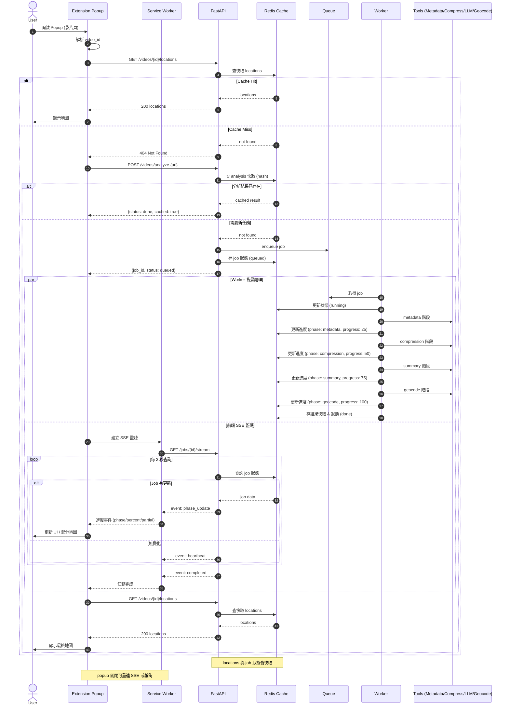

# TrailTag：YouTube 旅遊影片地圖化平台

## 專案簡介

TrailTag 旨在將 YouTube 旅遊影片自動化轉換為互動地圖路線，讓使用者能以地圖方式探索影片內容。現有 codebase 已完成核心 MVP 流程，包含影片資料擷取、字幕壓縮、主題摘要與地點座標化，並產出標準化 JSON artifacts。

## 技術規格

- **後端**：Python 3.12+，CrewAI，yt_dlp，requests，openai
- **前端**：尚未實作（規劃 React 18+）

## 主流程：分析請求與結果取得（一次性地點輸出）

下列序列圖說明 Chrome Extension 與後端 API 的核心互動、任務排程與部分結果（partial locations）推送機制。

### 前後端互動序列圖



---

## 後端 AI Agent 技術架構

### MVP

**1. 影片資料擷取**：

- 由 `YoutubeMetadataTool` 擷取影片 metadata 與字幕，產出 `video_metadata.json`。

**2. 字幕壓縮**：

- 若字幕過長，`SubtitleCompressionTool` 進行分段壓縮，保留地點相關上下文。

**3. 主題與地點摘要**：

- 以 NLP 工具（目前以簡單規則與關鍵詞為主）從字幕中擷取地點與主題，產出 `topic_summary.json`。

**4. 地點座標化**：

- `PlaceGeocodeTool` 解析地點名稱為經緯度，產出 `map_routes.json`。

### 主要 artifacts

- `outputs/video_metadata.json`
- `outputs/topic_summary.json`
- `outputs/map_routes.json`

### 目錄結構摘要

```txt
src/trailtag/
  main.py
  crew.py
  models.py
  tools/
    youtube_metadata_tool.py
    subtitle_compression_tool.py
    place_geocode_tool.py
outputs/
  video_metadata.json
  topic_summary.json
  map_routes.json
```

### 工具對應

| 步驟             | 工具/模組               | 輸出                                 |
| ---------------- | ----------------------- | ------------------------------------ |
| 1. 影片資料擷取  | YoutubeMetadataTool     | video_metadata.json                  |
| 2. 字幕壓縮      | SubtitleCompressionTool | 壓縮字幕 (內嵌於 topic_summary.json) |
| 3. 主題/地點摘要 | NLP/規則                | topic_summary.json                   |
| 4. 地點座標化    | PlaceGeocodeTool        | map_routes.json                      |

---

## 前端 Chrome Extension 流程說明

1. popup 開啟 → 讀取 `tabs.query` 取得目前 URL → 解析 video_id
1. 呼叫 `GET /api/videos/{video_id}/locations`

- 若 200 且有資料 → 直接 render 地圖
- 若 404 → 呼叫 `POST /api/videos/analyze`

1. 顯示「分析中」+ 進度條
1. 建立 SSE 連線 `/api/jobs/{job_id}/stream`（或 fallback 以輪詢 `/api/jobs/{job_id}`）
1. 收到 `partial_locations` 事件：增量更新地圖
1. 收到 `completed`：改為完成狀態，可顯示統計（地點數 / 耗時）
1. 用戶關閉 popup 後再開：先查快取（`chrome.storage.local` 保存最近 job 狀態 + timestamp）

### UI 狀態（Popup）

- idle（說明 + 按鈕「分析本影片」）
- analyzing（進度條 + 階段文字 + cancel 按鈕[可選]）
- partial map（地圖 + 「仍在解析其餘地點…」）
- done（完整地圖 + 匯出 GeoJSON）
- error（錯誤訊息 + 重試）

### 地圖渲染策略

- 使用 Leaflet + OpenStreetMap（免 API Key）
- Marker clustering（影片 >20 地點時）
- 點擊 marker 顯示：地點名稱、字幕節錄、時間碼（可選）
- 若有時間碼：提供「跳轉影片」功能（`https://www.youtube.com/watch?v=...&t=123s`）

### 與後端互動考量

| 挑戰             | 解法                                      |
| ---------------- | ----------------------------------------- |
| 任務長（數十秒） | SSE/輪詢 + partial push                   |
| 使用者關閉 popup | 狀態保存於 chrome.storage，重新開啟再接續 |
| 重複分析         | 後端 hash 快取 → 直接回傳 done            |
| API 失敗         | 指數退避 + 最多 3 次；前端顯示重試        |

### 權限（最小化）

- `tabs`（取得當前 URL）
- `storage`（本地狀態）
- `activeTab`（可選，避免過度權限）

### 後續增強

- 前端顯示路線排序（推測旅行順序）
- 多影片比較視圖（P6 對應）
- 探索模式：列出影片段落 → 點擊飛到 marker

---
