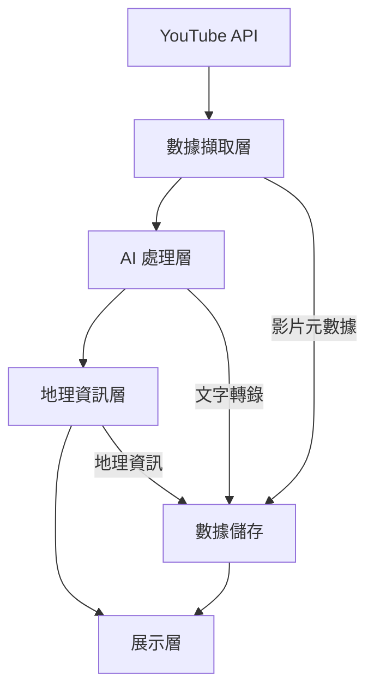

# TrailTag：YouTube 旅遊影片地圖化平台

## 專案概述

TrailTag 是一個創新的旅遊故事平台，致力於將 YouTube 旅遊創作者的影片內容轉化為互動式地圖體驗。通過先進的人工智慧技術，我們自動從影片中提取旅遊路線、景點位置和精彩亮點，讓使用者能夠以嶄新的方式探索和重現這些精彩的旅程。

## 核心目標

1. **智能數據提取**
   - 開發穩健的 AI 系統，自動從 YouTube 影片中識別和提取旅遊相關資訊
   - 實現多語言內容理解，支援中文、英文等主要語言
   - 建立高精度的地理位置辨識系統

2. **互動式地圖體驗**
   - 打造直覺的地圖介面，展示完整旅遊路線
   - 提供時間軸導覽功能，同步播放影片內容
   - 支援多平台存取（Web、行動裝置）

## 技術架構

### 系統概覽



### 核心組件

1. **數據擷取層**
   - YouTube Data API 整合
   - 影片下載與快取管理
   - 媒體格式轉換

2. **AI 處理層**
   - 語音轉文字（ASR）
   - 自然語言處理（NLP）
   - 地理實體識別

3. **地理資訊層**
   - 地理編碼服務整合
   - 路線最佳化
   - 空間數據分析

4. **展示層**
   - 互動式地圖介面
   - 影片同步播放器
   - 使用者互動組件

## 實施計畫

使用 CrewAI，我們將實施以下代理和任務：

1. **YouTube 數據擷取**：
   - 開發 `youtube_fetch_agent`，使用 YouTube API 擷取影片元數據、播放清單和可下載的媒體來源。
   - 處理 API 配額限制、去重和快取，以確保高效且可靠的數據擷取。
   - 輸出標準化的 `video_manifest.json`，包含下游任務所需的影片詳細資訊。
   - Tools：`youtube_dl`、`YoutubeChannelSearchTool`、`YoutubeVideoSearchTool`。

2. **音訊轉錄**：
   - 使用 `transcription_agent` 從影片中提取音訊並轉錄為帶有時間戳的文字稿。
   - 實施多語言自動語音識別（ASR），並為噪音或複雜音訊提供備援機制。
   - 生成結構化的 JSON 和 SRT 格式的文字稿以供進一步處理。
   - Tools：`whisper`, `vosk`, `pocketsphinx`。

3. **關鍵字提取**：
   - 使用 `keyword_extraction_agent` 從文字稿中識別地理實體（例如城市、地標）和旅遊相關活動。
   - 正規化並聚合同義詞（例如「Taipei」、「台北」、「TPE」），以建立地理實體的標準化列表。
   - 保留每個提取實體的時間範圍和信心分數。
   - tools：`spaCy`、`nltk`、`transformers`。

4. **地理編碼**：
   - 利用 `geocoding_agent` 將提取的地理實體解析為精確的經緯度座標。
   - 處理多義名稱（例如「Paris」在法國與德州）並使用上下文資訊和多個地理編碼 API。
   - 輸出 `geocoded_points.json`，包含信心分數和未解決的實體標記。
   - Tools：`geopy`、`googlemaps`、`nominatim`。

5. **路線組裝**：
   - 實施 `route_builder_agent`，從地理編碼點構建時空旅遊路線。
   - 按時間戳排序點，聚合附近地點，並檢測路線中的間隙或跳躍。
   - 生成 GeoJSON 文件（`route_geo.json`），表示旅遊路徑及其元數據。
   - Tools：`osmnx`、`geopandas`。

6. **互動式地圖渲染**：
   - 使用 `map_rendering_agent` 創建與 Leaflet 或 Mapbox 相容的互動式地圖配置。
   - 將地圖標記綁定到影片的時間戳和縮圖，以實現無縫播放集成。
   - 優化地圖負載以實現輕量級的前端渲染。
   - Tools：`leaflet.js`、`mapbox-gl-js`。

7. **協作調度**：
   - 開發 `orchestrator_agent`，協調整個管線，管理任務依賴性、重試和錯誤處理。
   - 監控中間輸出並記錄質量指標（例如 ASR 覆蓋率、地理編碼準確性）。
   - 生成綜合的 `run_summary.json`，詳細說明管線執行狀態和結果。
   - Tools：`airflow`、`prefect`。

每個代理和任務將進行迭代測試和改進，以確保高準確性和可靠性。最終系統將使使用者能夠通過直觀且互動的地圖介面探索 YouTube 旅遊影片。

### 系統流程

TrailTag 採用 CrewAI 框架實現智能代理協作，主要流程如下：

1. **初始化流程** `@start()`
   ```python
   @start()
   async def initialize_pipeline(config: PipelineConfig):
       await setup_youtube_credentials(config.api_key)
       return await initialize_processing_state()
   ```

2. **數據處理流程** `@listen()`
   ```python
   @listen('video_processed')
   async def process_metadata(event: VideoProcessedEvent):
       data = await normalize_metadata(event.data)
       return await save_to_database(data)
   ```

3. **智能路由** `@router()`
   ```python
   @router('geo_entity')
   async def route_geocoding(entity: GeoEntity):
       if entity.confidence > 0.8:
           return await precise_geocoding(entity)
       return await fuzzy_geocoding(entity)
   ```

### 技術規格

#### 開發環境
- **後端**：Python 3.12+
- **前端**：Next.js 14+
- **資料庫**：MongoDB 7.0
- **快取**：Redis 7.2

### 數據模型設計

為了支持各階段的數據處理與交互，我們設計了以下數據物件，這些物件將作為各任務的輸入與輸出：

1. **VideoManifest**
   - 描述：包含從 YouTube 擷取的影片元數據與媒體資訊。
   - 結構：
     ```json
     {
       "source_params": {"channel_id": "...", "playlist_id": "..."},
       "fetch_timestamp": "2025-07-17T02:11:00Z",
       "channel_meta": {"channel_id": "...", "title": "..."},
       "videos": [
         {
           "video_id": "abc123",
           "title": "台北一日遊",
           "published_at": "2025-05-01T08:00:00Z",
           "duration_s": 734,
           "watch_url": "https://youtube.com/watch?v=abc123",
           "media": {"video_url": "...", "audio_url": "..."},
           "status": "ok"
         }
       ],
       "errors": [
         {"video_id": "zzz999", "reason": "private_video"}
       ]
     }
     ```

2. **Transcripts**
   - 描述：包含影片音訊的轉錄文字與時間戳。
   - 結構：
     ```json
     {
       "transcripts": [
         {
           "video_id": "abc123",
           "segments": [
             {"start_s": 0.0, "end_s": 3.2, "text": "嗨大家好我們今天在台北車站", "lang": "zh", "conf": 0.86}
           ],
           "coverage_ratio": 0.93,
           "avg_conf": 0.84,
           "status": "ok"
         }
       ]
     }
     ```

3. **GeoCandidates**
   - 描述：從轉錄文字中提取的地理實體候選。
   - 結構：
     ```json
     {
       "candidates": [
         {
           "video_id": "abc123",
           "canonical_name": "台北 101",
           "raw_mentions": ["台北101", "Taipei 101"],
           "type": "poi",
           "first_start_s": 120.5,
           "confidence": 0.87
         }
       ]
     }
     ```

4. **GeocodedPoints**
   - 描述：地理實體的經緯度解析結果。
   - 結構：
     ```json
     {
       "points": [
         {
           "video_id": "abc123",
           "canonical_name": "台北 101",
           "lat": 25.033968,
           "lng": 121.564468,
           "place_type": "poi",
           "confidence": 0.95
         }
       ],
       "unresolved": [
         {"canonical_name": "老街XX", "reason": "no_match"}
       ]
     }
     ```

5. **RouteGeo**
   - 描述：基於地理點構建的旅遊路線。
   - 結構：
     ```json
     {
       "type": "FeatureCollection",
       "features": [
         {
           "type": "Feature",
           "geometry": {"type": "LineString", "coordinates": [[121.564468, 25.033968], [121.5718, 25.0273]]},
           "properties": {
             "video_id": "abc123",
             "segment_id": "abc123_seg0",
             "start_s": 120.5,
             "end_s": 600.0,
             "confidence": 0.8
           }
         }
       ]
     }
     ```

6. **MapConfig**
   - 描述：互動式地圖的配置文件。
   - 結構：
     ```json
     {
       "base_map": "osm",
       "initial_view": {"lat": 25.04, "lng": 121.56, "zoom": 12},
       "markers": [
         {
           "id": "abc123_p0",
           "name": "台北 101",
           "lat": 25.033968,
           "lng": 121.564468,
           "video_id": "abc123",
           "start_s": 120.5,
           "confidence": 0.95
         }
       ]
     }
     ```

### 持久化儲存設計

系統採用多層次的數據儲存策略：

#### 1. MongoDB 集合設計

```typescript
// 1. 頻道資訊
interface Channel {
    _id: ObjectId;
    channelId: string;          // YouTube 頻道 ID
    title: string;              // 頻道名稱
    language: string;           // 主要語言
    subscribers: number;        // 訂閱人數
    lastUpdated: Date;         // 最後更新時間
    status: 'active' | 'paused';
}

// 2. 影片資訊
interface Video {
    _id: ObjectId;
    channelId: string;        // 關聯頻道
    videoId: string;          // YouTube 影片 ID
    title: string;           // 標題
    publishedAt: Date;       // 發布時間
    duration: number;        // 長度（秒）
    processingStatus: {
        transcript: boolean;  // 轉錄完成
        geocoding: boolean;  // 地理編碼完成
        route: boolean;      // 路線生成完成
    };
}

// 3. 地理位置資訊
interface Location {
    _id: ObjectId;
    videoId: string;         // 關聯影片
    name: string;           // 地點名稱
    coordinates: {
        lat: number;
        lng: number;
    };
    timestamp: number;      // 影片時間點（秒）
    confidence: number;     // 準確度評分
}
```
