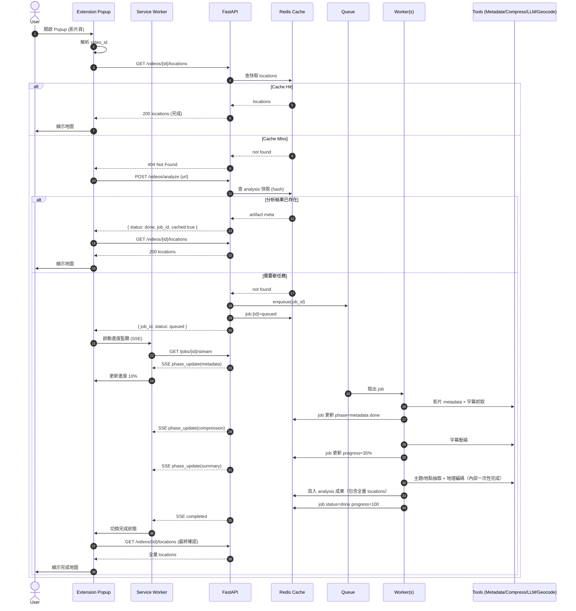
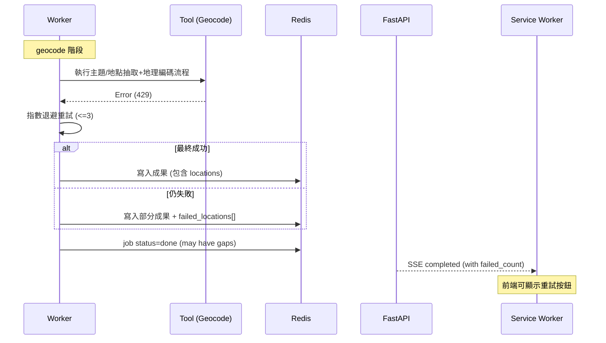

# TrailTag：YouTube 旅遊影片地圖化平台

## 專案簡介

TrailTag 旨在將 YouTube 旅遊影片自動化轉換為互動地圖路線，讓使用者能以地圖方式探索影片內容。現有 codebase 已完成核心 MVP 流程，包含影片資料擷取、字幕壓縮、主題摘要與地點座標化，並產出標準化 JSON artifacts。

---

## 目前系統現況

### 主要功能與檔案結構

- **影片資料擷取**：`YoutubeMetadataTool` 於 `src/trailtag/tools/youtube_metadata_tool.py`，負責抓取影片 metadata 與字幕。
- **字幕壓縮**：`SubtitleCompressionTool` 於 `src/trailtag/tools/subtitle_compression_tool.py`，針對長字幕進行分段壓縮。
- **地點座標化**：`PlaceGeocodeTool` 於 `src/trailtag/tools/place_geocode_tool.py`，將地點名稱轉換為經緯度。
- **主流程腳本**：`src/trailtag/main.py`，整合上述工具，串接 CrewAI 任務。
- **Artifacts 輸出**：
  - `outputs/video_metadata.json`：影片基本資料與字幕
  - `outputs/topic_summary.json`：主題與地點摘要
  - `outputs/map_routes.json`：地點座標與路線

### 目錄結構摘要

```txt
src/trailtag/
  main.py
  crew.py
  models.py
  tools/
    youtube_metadata_tool.py
    subtitle_compression_tool.py
    place_geocode_tool.py
outputs/
  video_metadata.json
  topic_summary.json
  map_routes.json
```

---

## 技術架構與流程

### MVP 流程

**1. 影片資料擷取**：

- 由 `YoutubeMetadataTool` 擷取影片 metadata 與字幕，產出 `video_metadata.json`。

**2. 字幕壓縮**：

- 若字幕過長，`SubtitleCompressionTool` 進行分段壓縮，保留地點相關上下文。

**3. 主題與地點摘要**：

- 以 NLP 工具（目前以簡單規則與關鍵詞為主）從字幕中擷取地點與主題，產出 `topic_summary.json`。

**4. 地點座標化**：

- `PlaceGeocodeTool` 解析地點名稱為經緯度，產出 `map_routes.json`。

### 主要 artifacts

- `outputs/video_metadata.json`
- `outputs/topic_summary.json`
- `outputs/map_routes.json`

---

## 主要流程與工具對應

| 步驟 | 工具/模組 | 輸出 |
| ---- | -------- | ---- |
| 1. 影片資料擷取 | YoutubeMetadataTool | video_metadata.json |
| 2. 字幕壓縮 | SubtitleCompressionTool | 壓縮字幕 (內嵌於 topic_summary.json) |
| 3. 主題/地點摘要 | NLP/規則 | topic_summary.json |
| 4. 地點座標化 | PlaceGeocodeTool | map_routes.json |

---

## 技術規格

- **後端**：Python 3.12+，CrewAI，yt_dlp，requests，openai
- **前端**：尚未實作（規劃 React 18+）

---

## 測試與驗證

- 已針對 `SubtitleCompressionTool`、`TokenCountTool`、`YoutubeSubtitleTool` 等撰寫單元測試，位於 `tests/` 目錄。
- 主要流程可透過 `crewai run` 指令執行，並於 `outputs/` 目錄產生對應 JSON。

---

---

## 字幕壓縮策略

`SubtitleCompressionTool` 會根據字幕長度自動分段壓縮，保留地點相關內容。流程包含：

- Token 粗估，超閾值才壓縮
- Chunk 分割，地點 chunk 降低壓縮比
- 地點候選偵測（Regex + 關鍵詞）
- Map/Reduce 摘要與合併，召回不足時自動重跑

---

## 地圖路線生成

1. 從 `topic_summary.json` 篩選地點項目
2. 組合國家/城市/名稱
3. 以 `PlaceGeocodeTool` 查詢座標
4. 組裝為路線資料，輸出 `map_routes.json`

---

## API 化與未來規劃

- 規劃將 CrewAI 流程包裝為 FastAPI 服務，支援非同步任務與快取。
- 端點設計、狀態管理、快取策略等詳見原規劃。

---

## 後端 API 化設計（新）

### 目標

- 將目前單一 `main.py` 同步執行流程重構為「提交分析工作 → 非同步排程 → 查詢進度 / 取得結果」的服務。
- 降低長時間 CrewAI 任務對前端用戶體驗的阻塞，支援重複請求快取與可續傳。

### 架構概覽

- Web 層：FastAPI (REST + SSE / WebSocket 選擇其一作即時推播)
- 任務排程：Celery / RQ（二選一；P0 可先用 ThreadPool + in‑memory queue，P1 換成 Redis + Celery）
- 工作佇列 / 快取：Redis
- 永久儲存（可選）：SQLite / Postgres（先存 JSON artifacts 檔案 + 索引表，P2 再遷移 DB）
- Artifacts：仍輸出至 `outputs/`，同時提供下載或 JSON 回傳

### 核心資料模型（邏輯）

| Model | Key Fields | 說明 |
| ----- | ---------- | ---- |
| Job | job_id (uuid), status, created_at, updated_at, video_id, hash_key | 代表一次分析請求 |
| VideoAnalysis | video_id, artifacts_paths, summary_stats, locations_count | 分析成果索引 |
| Location | video_id, name, country, city, lat, lon, confidence | 地點點資料 |

（P0 可先以記憶體 + 檔名規則儲存；狀態以 Redis Hash 維護）

### 端點設計（初版）

| Method | Path | 功能 | 備註 |
| ------ | ---- | ---- | ---- |
| POST | /api/videos/analyze | 提交分析（body: url 或 video_id）| 回傳 job_id；快取命中直接 status=done |
| GET | /api/jobs/{job_id} | 查詢工作狀態 | status: queued / running / failed / done + progress |
| GET | /api/jobs/{job_id}/stream | SSE 推送進度 | 事件：phase_update / completed / error / heartbeat |
| GET | /api/videos/{video_id}/locations | 回傳地點視覺化資料 | MapVisualization 一次性全量 |
| POST | /api/videos/{video_id}/geocode/retry | （未來）重試特定失敗地點 | 選用 |

### 任務生命週期

1. 接收請求 → 正規化 URL 取 video_id → 建 hash_key（video_id + strategy_version）
1. Redis 查快取：若已完成 → 回傳 `status=done`
1. 無快取：建立 Job(status=queued) → 推入 queue
1. Worker 拉取：逐階段執行（metadata → subtitle compress → topic summary → geocode）
1. 每階段更新 Job.progress 與階段標記（不寫入對外 partial artifacts）
1. 完成：寫入索引 / 快取 TTL，標記 done
1. 失敗：寫 status=failed 並附錯誤分類（transient / permanent），前端可顯示重試選項

### 進度回報策略

- `progress`: 0~100（按階段權重：metadata 10 / compression 25 / summary 35 / geocode 30）
- SSE event types：phase_update, completed, error, heartbeat（僅傳遞階段與百分比，不推送地點資料）
- 地點資料僅在全流程完成後一次性產生與提供（無增量地點串流）。

### 快取與冪等

- Key: `analysis:{video_id}:{strategy_version}`
- Strategy Hash: 輸入字幕 + 策略參數（壓縮 chunk size、LLM model）→ 控制 MapVisualization 快取失效
- 讀取時先檢查 version，不符則觸發重跑

### 可觀測性

- 結構化 log 欄位：job_id, video_id, phase, elapsed_ms, tool_name, tokens_in/out
- 指標（Prometheus）：jobs_total、phase_duration_seconds、geocode_success_ratio、retry_count
- Alert 條件：geocode_success_ratio < 閾值；failed_jobs_rate > 閾值

### 失敗與重試策略

| 類型 | 範例 | 策略 |
| ---- | ---- | ---- |
| Transient | API timeout / 429 | 指數退避 + 最大 3 次 |
| Deterministic | Invalid video id | 立即 failed，不重試 |
| Partial | Geocode 某些地點失敗 | 標記缺失，照常完成 + 提供 retry geocode 端點（P1.5） |

### 安全 / 限速

- Rate Limit：同一 IP 對 `/analyze` 每分鐘 N 次
- API Key（未來 SaaS）：Header `X-Api-Key`
- CORS：限制來源（初期 extension origin + localhost）

### 延伸（後續階段）
<!-- 重複端點表已合併至上方，移除此區塊 -->

MapVisualization 回傳示例：

```json
{
  "video_id": "abc123",
  "routes": [
    {
      "location": "Taipei 101",
      "coordinates": [121.5645, 25.0339],
      "description": "觀景台夜景",
      "timecode": "00:05:12,000",
      "tags": ["landmark"],
      "marker": "poi"
    }
  ]
}
```

Artifacts：內部仍輸出至 `outputs/`（除錯/後續擴充），不提供公開端點；對外只需最終 MapVisualization。

5. 每階段更新 Job.progress 與階段標記（不寫入對外 partial artifacts）

Strategy Hash: 輸入字幕 + 策略參數（壓縮 chunk size、LLM model）→ 控制 MapVisualization 快取失效

<!-- 序列圖中已更新「分析結果已存在」分支語意，文字重複敘述移除 -->
| styles.css | 簡易樣式 |
| map.js | Leaflet / MapLibre 初始化與 marker 管理 |

### 流程

1. popup 開啟 → 讀取 `tabs.query` 取得目前 URL → 解析 video_id
1. 呼叫 `GET /api/videos/{video_id}/locations`

- 若 200 且有資料 → 直接 render 地圖
- 若 404 → 呼叫 `POST /api/videos/analyze`

1. 顯示「分析中」+ 進度條
1. 建立 SSE 連線 `/api/jobs/{job_id}/stream`（或 fallback 以輪詢 `/api/jobs/{job_id}`）
1. 收到 `partial_locations` 事件：增量更新地圖
1. 收到 `completed`：改為完成狀態，可顯示統計（地點數 / 耗時）
1. 用戶關閉 popup 後再開：先查快取（`chrome.storage.local` 保存最近 job 狀態 + timestamp）

### UI 狀態（Popup）

- idle（說明 + 按鈕「分析本影片」）
- analyzing（進度條 + 階段文字 + cancel 按鈕[可選]）
- partial map（地圖 + 「仍在解析其餘地點…」）
- done（完整地圖 + 匯出 GeoJSON）
- error（錯誤訊息 + 重試）

### 地圖渲染策略

- 使用 Leaflet + OpenStreetMap（免 API Key）
- Marker clustering（影片 >20 地點時）
- 點擊 marker 顯示：地點名稱、字幕節錄、時間碼（可選）
- 若有時間碼：提供「跳轉影片」功能（`https://www.youtube.com/watch?v=...&t=123s`）

### 與後端互動考量

| 挑戰 | 解法 |
| ---- | ---- |
| 任務長（數十秒） | SSE/輪詢 + partial push |
| 使用者關閉 popup | 狀態保存於 chrome.storage，重新開啟再接續 |
| 重複分析 | 後端 hash 快取 → 直接回傳 done |
| API 失敗 | 指數退避 + 最多 3 次；前端顯示重試 |

### 權限（最小化）

- `tabs`（取得當前 URL）
- `storage`（本地狀態）
- `activeTab`（可選，避免過度權限）

### 後續增強

- 前端顯示路線排序（推測旅行順序）
- 多影片比較視圖（P6 對應）
- 探索模式：列出影片段落 → 點擊飛到 marker

---

## 前後端互動序列圖

下列序列圖說明 Chrome Extension 與後端 API 的核心互動、任務排程與部分結果（partial locations）推送機制。

### 主流程：分析請求與結果取得（一次性地點輸出）



### 失敗與重試（簡化）



### 流程重點摘記

- 無地點增量推送；地點與經緯度於任務完成後一次性寫入並供查詢。
- SSE 僅用於傳遞進度與完成/錯誤事件。
- 失敗地點列表（若有）一併附於完成階段，可再觸發重試端點（未來擴充）。

---

## 快取策略

- 以 (video_id, search_subject) 為 key，命中時直接回傳 artifacts
- 字幕壓縮策略版本異動時自動失效

---

## 觀測與品質

- 結構化日誌：job_id、video_id、phase、耗時
- 指標：字幕 token 數、壓縮後 token、地點候選數、地理編碼成功率等
- Alert：地理編碼成功率過低、地點召回不足時警示

---

## 風險與緩解

| 風險 | 描述 | 緩解 |
| ---- | ---- | ---- |
| 長字幕超 token | 單步驟失敗或成本過高 | 分段壓縮 + 主題過濾 |
| 地點誤判 | 模糊或多義地名 | 加上下文 (城市/國家) + 多 API 交叉比對 |
| API 配額 | YouTube / Geocoding 限制 | 本地快取 + 速率限制 |
| Hallucination | LLM 產生不存在地點 | 比對原字幕 substring + 召回不足回退低壓縮 |
| 重跑時間長 | 重複分析相同影片 | Hash + 快取 |

---

## Roadmap

| 階段 | 重點 | 產出 |
| ---- | ---- | ---- |
| P0 | 影片資料擷取/壓縮/地點座標化 | MVP JSON 輸出 |
| P1 | 後端 API 化 + 任務排程 + 快取 | RESTful + 非同步 Job |
| P1.5 | Chrome Extension v1（地圖標記 + 進度） | 瀏覽器擴充功能 MVP |
| P2 | 增加 ASR (Whisper) | 自主語音轉錄 |
| P3 | NER/Embedding 過濾 | 更高精度地點清單 |
| P4 | GeoJSON 路線建構 + GeoJSON API | route_geo.json |
| P5 | 前端 Web 互動地圖（多影片匯總） | Web Demo |
| P6 | 多影片聚合/搜尋 | 跨影片主題索引 |

---

## 授權與安全

- API Key 管理、速率限制、敏感金鑰 .env 管理
- 僅處理公開影片資料，不儲存個資

---

## Backlog

- [ ] SubtitleCompressionTool 單元測試補齊
- [ ] pipeline_runner Celery 化（可選）
- [ ] 地點解析多來源投票
- [ ] SSE / WebSocket streaming logs
- [ ] 指標上報 Prometheus/Grafana
- [ ] FastAPI 初版端點（/analyze, /jobs/{id}, /videos/{id}/locations）
- [ ] Redis 快取 + 任務狀態儲存
- [ ] Chrome Extension MVP（popup + 進度 + 地圖）
- [ ] Leaflet marker clustering
- [ ] Partial geocode 重試端點
